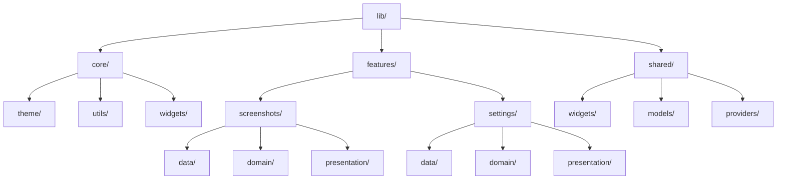

# Proposed Modular Folder Architecture for SnapGrid

This document outlines a new folder structure for SnapGrid, designed to improve maintainability, scalability, and adherence to clean architecture principles.

---

## Current Structure

The current `lib/` directory structure is as follows:
- `core/`: Contains themes, utilities, and widgets.
- `features/`: Includes feature-specific folders like `screenshots` and `settings`.
- `models/`: Houses shared data models.
- `providers/`: Contains state management logic.
- `services/`: Includes service classes for external integrations.
- `views/`: Contains UI views.

---

## Proposed Structure

### Top-Level Organization

```
lib/
├── core/                # Core utilities and configurations
│   ├── theme/           # App-wide theming
│   ├── utils/           # General utilities
│   └── widgets/         # Reusable UI components
├── features/            # Feature-based organization
│   ├── screenshots/     # Screenshot management
│   │   ├── data/        # Data sources and repositories
│   │   ├── domain/      # Business logic and use cases
│   │   └── presentation/ # UI components and screens
│   ├── settings/        # App settings
│   │   ├── data/
│   │   ├── domain/
│   │   └── presentation/
│   └── ...              # Additional features
├── shared/              # Shared resources
│   ├── widgets/         # Shared UI components
│   ├── models/          # Shared data models
│   └── providers/       # Shared state management
└── main.dart            # App entry point
```

---

## Benefits of the New Structure

1. **Separation of Concerns**: Clear distinction between core utilities, feature-specific logic, and shared resources.
2. **Scalability**: Feature-based organization allows for easy addition of new features without affecting existing ones.
3. **Maintainability**: Clean architecture principles (data, domain, presentation layers) make the codebase easier to understand and test.
4. **Reusability**: Shared components and utilities are centralized, reducing duplication.

---

## Diagram



---

This proposed structure aligns with Flutter best practices and the goals outlined in the Detailed Enhancement Plan.
